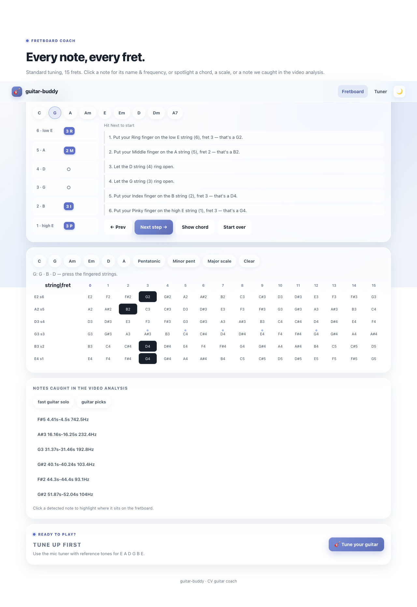

# Guitar Buddy

Guitar Buddy is an offline-first guitar practice toolkit. It combines a browser-based chord, song, and tuning interface with an experimental Python computer-vision pipeline that maps a player's fingertips onto guitar strings and frets.

The useful parts are already usable independently:

- learn common chord shapes one finger at a time;
- explore a 6-string, 15-fret note map;
- load a MIDI file and step through its chord progression;
- tune a guitar from the browser microphone; and
- run the vision, audio, scoring, and tutoring components from Python.



## Try the browser app

On macOS, the included Makefile provides a one-command setup:

```bash
make
```

That creates `.venv`, installs the Python dependencies once, starts the web app at <http://localhost:8000>, and opens it in your browser. The server runs in the background; stop it with:

```bash
make stop
```

To use another port, override `PORT`, for example `make PORT=8080`. On Linux or Windows, or when you prefer to manage the environment yourself, use the manual setup below.

| Page | What it does |
| --- | --- |
| `index.html` | Chord lessons, chord/scale highlighting, and an interactive fretboard |
| `song.html` | Browser-side MIDI parsing, chord timeline, playback, and guided fingering |
| `tuner.html` | Six-string tuner with live pitch detection and reference tones |

The bundled `cream.mid` is a short, programmatically generated C–Am–F–G progression—not a recording or transcription of the band Cream. Regenerate it with `python scripts/gen_sample.py`.

## Run the Python tools

The Makefile covers the common development workflows:

```bash
make help                         # list available targets
make test                         # run tests and the coverage gate
make run                          # start webcam hand tracking
make demo IMG=path/to/photo.jpg   # analyze an image
make bench VID=path/to/video.mp4  # benchmark video inference on CPU
make web                          # foreground web server
make clean                        # remove .venv and generated artifacts
```

`make run`, `make demo`, `make bench`, and `make test` expect the environment created by `make` or `make venv`.

For manual setup, create an isolated environment and install the direct dependencies:

```bash
python3 -m venv .venv
.venv/bin/pip install -r requirements.txt
```

Then run the automated suite:

```bash
.venv/bin/python -m pytest
```

Run hand tracking from a webcam:

```bash
.venv/bin/python scripts/run_webcam.py
```

On macOS, launch that command from an interactive terminal and grant Camera access when prompted. `run_webcam.command` provides the same entry point for Finder.

Run the full detector against your own image or video:

```bash
.venv/bin/python scripts/pipeline_demo.py path/to/guitar-photo.jpg
.venv/bin/python scripts/bench_video.py path/to/guitar-video.mp4 --device cpu
```

User-supplied recordings belong under `data/audio/` and `data/videos/`; those folders are ignored so personal or third-party media is not accidentally redistributed.

## How the vision path works

```text
camera frame
  -> guitar bounding box
  -> four neck keypoints
  -> perspective-corrected fretboard
  -> geometric fret fit + temporal smoothing
  -> MediaPipe fingertips
  -> (string, fret) positions
  -> expected MIDI notes + coaching feedback
```

The implementation deliberately mixes learned and geometric components. YOLO locates the guitar and neck, OpenCV rectifies the neck, a 12-tone geometric model fits fret wires, and a Kalman-based stabilizer rejects frame-to-frame spikes. MediaPipe supplies hand landmarks, while the mapper, MIDI reader, scorer, and tutor remain plain Python modules that can be tested without a camera.

## What is ready

- Browser chord coach, fretboard explorer, MIDI song coach, and tuner
- Guitar detection and four-point neck localization
- Homography-based fretboard rectification
- Orientation-aware fret fitting and six-string estimation
- Full-frame fingertip-to-fretboard coordinate mapping
- Temporal smoothing and spike rejection
- MIDI parsing, note-to-string/fret mapping, scoring, and session feedback
- Audio pitch segmentation for WAV input
- Automated tests for the reusable Python components

The main unfinished piece is robust live end-to-end recognition. Neck keypoints can drift when a hand heavily occludes the fretboard, and the final camera loop still needs calibration and validation across guitars, camera angles, lighting, and left-handed layouts. Treat detected notes and scores as practice feedback, not ground truth.

## Repository map

```text
src/       reusable vision, audio, MIDI, mapping, scoring, and tutor modules
scripts/   webcam entry point, demos, benchmarks, generators, and diagnostics
web/       dependency-free browser UI and generated sample data
models/    bundled guitar/neck/finger and MediaPipe model assets
tests/     headless unit and integration tests
data/      ignored workspace for user-provided media and generated output
```

The most relevant modules are:

- `src/guitar_detector.py` — YOLO orchestration and neck rectification
- `src/fret_localizer.py` — geometric fret progression fitting
- `src/fret_mapper.py` — image-coordinate to string/fret mapping
- `src/hand_tracker.py` — MediaPipe hand landmarks
- `src/midi_reader.py` and `src/song_track.py` — timed musical expectations
- `src/scorer.py` and `src/tutor.py` — comparison and coaching state

## Models and provenance

The repository includes four model assets so the demos work offline:

| Asset | Source | License |
| --- | --- | --- |
| `Guitar-Detection.pt` | [MaksymMaryniuk/Guitar-Analyzer](https://github.com/MaksymMaryniuk/Guitar-Analyzer) | MIT |
| `Neck-Keypoints.pt` | [MaksymMaryniuk/Guitar-Analyzer](https://github.com/MaksymMaryniuk/Guitar-Analyzer) | MIT |
| `Finger-Pose2.pt` | [MaksymMaryniuk/Guitar-Analyzer](https://github.com/MaksymMaryniuk/Guitar-Analyzer) | MIT |
| `hand_landmarker.task` | [Google MediaPipe Hand Landmarker](https://developers.google.com/edge/mediapipe/solutions/vision/hand_landmarker) | Apache-2.0 |

Checksums, exact source locations, retained notices, and dependency licensing notes are in [THIRD_PARTY_NOTICES.md](THIRD_PARTY_NOTICES.md).

## License

Guitar Buddy is licensed under the [GNU Affero General Public License v3.0 or later](LICENSE). This matches the open-source terms of the Ultralytics dependency used by the vision pipeline. If you cannot satisfy the AGPL requirements—particularly for a proprietary or hosted product—obtain appropriate commercial terms from Ultralytics before distributing or deploying the YOLO-powered path.

Third-party components remain under their own licenses; see [THIRD_PARTY_NOTICES.md](THIRD_PARTY_NOTICES.md). No license is granted for media you place in `data/`.

Copyright © 2026 Josh Jaquez and contributors.
